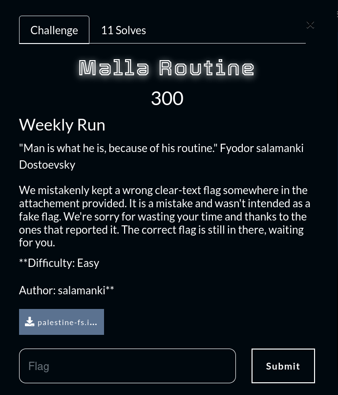

# Malla routine

## Objective&#x20;

The objective of this task is to highlight the importance of clear-text creds in running scripts and scheduled tasks. Since that's an issue I often run into when enumerating HTB boxes, I wanted the players to be aware of this mistake, since this issue can happen when building our university projects.&#x20;


## Task

<figure><figcaption></figcaption></figure>

Given palestine-fs.img.gz file, we simply extract and mount the raw disk image using: &#x20;

```bash
gzip -d palestine-fs.img.gz
sudo mount -o loop palestine-fs.img /mnt/palestine
```

Or simply double click the .img file after decompressing it.

The diskk image contains what appears to be a Linux file system:

<figure><figcaption></figcaption></figure>

The first thing that is unusual is the scripts directory which contains two bash scripts:

<figure><figcaption></figcaption></figure>

At first this looks promising, a good reflex tho but it leads to nothing since they contain just basic operations.

Still, looking for txt, database files and scripts is our first target since they can represent a low hanging fruit.

What i like to do in situations like these, is simply running tree on the /mnt/palestine directory and see if the FS is heavily nested, contains binaries or other system files irrelevant for us in this stage.

```bash
tree . | less
```

Luckily in this case, the FS isn't a real system's and we can see few files and directories. We can extract the file names and have a quick look at them.

<figure><figcaption></figcaption></figure>

Okay there is something about a login somewhere. Something about a boycott and a weekly run. This is a hint. Weekly run, the challenge name itself, they all refer to the automation and weekly, daily or monthly running script.

After some other enumeration we find etc/cron.weekly/securinets\_sync&#x20;

<figure><figcaption></figcaption></figure>

This sends a post request with the user securinets' credentials which are retreived from opt/.weekly.pass. Many players found this file, but when trying to acces the file they look for it in their system's /opt . Since it prints file is not found, they thought its about recovering a deleted file.

So we go to the file to find the base64 encoded flag:

<figure><figcaption></figcaption></figure>

As I said, this is not about the difficulty of the challenge, but a ew skill and something to look for when enumerating boxes or  mistakes we should avoid.
